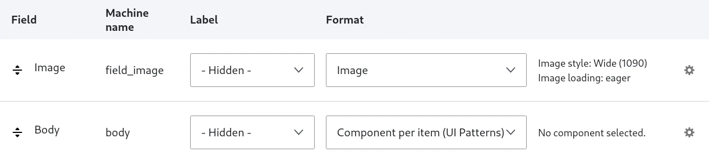
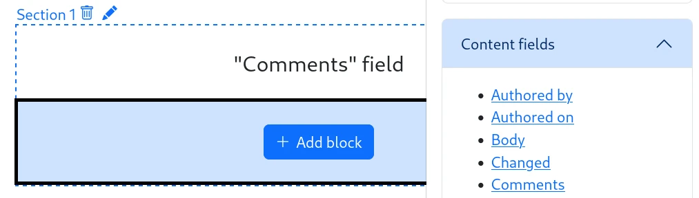
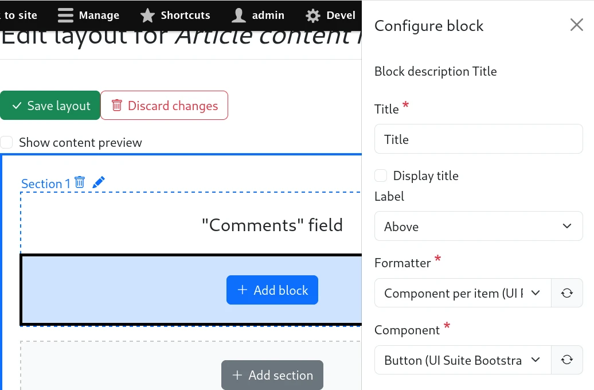
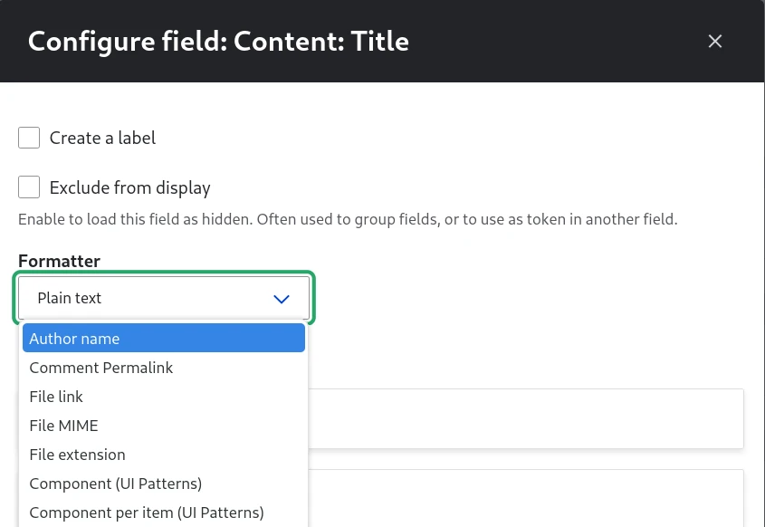
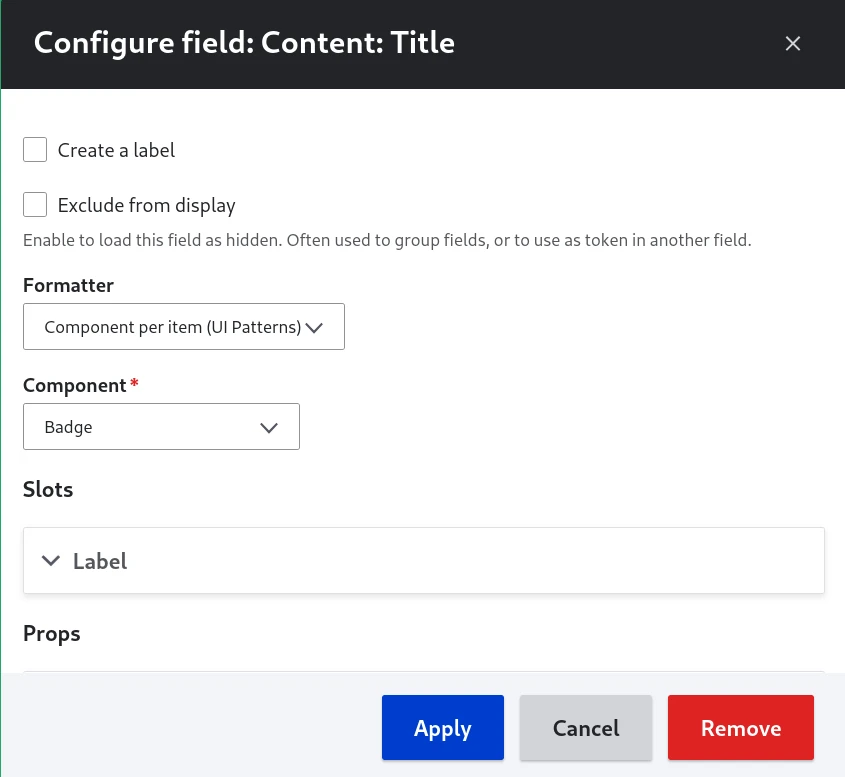

# Using a component in field formatters

Field Formatters are Drupal plugins formatting the output of a content field. For example:

- Date field formatted as "... time ago"
- Date field formatted with a custom date format
- Entity reference field formatted as label
- Entity reference field formatted as a rendered entity
- ...

There are 2 field formatters provided by `ui_patterns_field_formatters` sub-module:

- **Component per item**: Each item will be displayed as a component.
- **Component**: Available only for multi-valued fields. The full field is displayed as a component.

## In Manage Display

Manage display manages the way your content is displayed on the frontend.

The UI Patterns field formatters are available in the format select list, for every fields,

Once selected, the field formatters are configurable as usual field formatters, with the UI Patterns 2's [Component form](3.0-component-form.md)

### Contextual data sources

| Context         | Source              | Prop type | Description                                |
| --------------- | ------------------- | --------- | ------------------------------------------ |
| Field           | Field formatter     | Slot      |
| Field           | Field label         | String    |
| Field           | Field prop: \*      | (many)    |
| Reference field | Field prop: entity  |           | Switch to a Content entity context.        |
| Content entity  | Data from a field   |           | Switch to a Field context.                 |
| Content entity  | Entity link         | URL       |
| Content entity  | Referenced entities |           | Switch to an other Content entity context. |

## In Layout Builder

Drupal's Layout Builder allows content editors and site builders to create visual layouts for displaying content. Users can customize how content is arranged on a single page, across types of content, or even create custom landing pages with an easy to use drag-and-drop interface.

Fields are available as blocks:

Once selected, the field formatters are configurable as usual field formatters, with the UI Patterns 2's [Component form](3.0-component-form.md):

### Contextual data sources

| Context         | Source              | Prop type | Description                                |
| --------------- | ------------------- | --------- | ------------------------------------------ |
| Field           | Field formatter     | Slot      |
| Field           | Field label         | String    |
| Field           | Field prop : \*     | (many)    |
| Reference field | Field prop: entity  |           | Switch to a Content entity context.        |
| Content entity  | Data from a field   |           | Switch to a Field context.                 |
| Content entity  | Entity link         | URL       |
| Content entity  | Referenced entities |           | Switch to an other Content entity context. |

## In Views

Drupal Views is both:

- a query builder: fetch content from the database, with filters, sorts and grouping.
- a display builder: present the results as lists, galleries, tables, maps, graphs, reports...

If your display accepts fields, the field formatters are available:

Once selected, the field formatters are configurable as usual field formatters, with the UI Patterns 2's [Component form](3.0-component-form.md):

### Contextual data sources

| Context         | Source              | Prop type | Description                                |
| --------------- | ------------------- | --------- | ------------------------------------------ |
| Field           | Field formatter     | Slot      |
| Field           | Field label         | String    |
| Field           | Field prop: \*      | (many)    |
| Reference field | Field prop: entity  |           | Switch to a Content entity context.        |
| Content entity  | Data from a field   |           | Switch to a Field context.                 |
| Content entity  | Entity link         | URL       |
| Content entity  | Referenced entities |           | Switch to an other Content entity context. |
