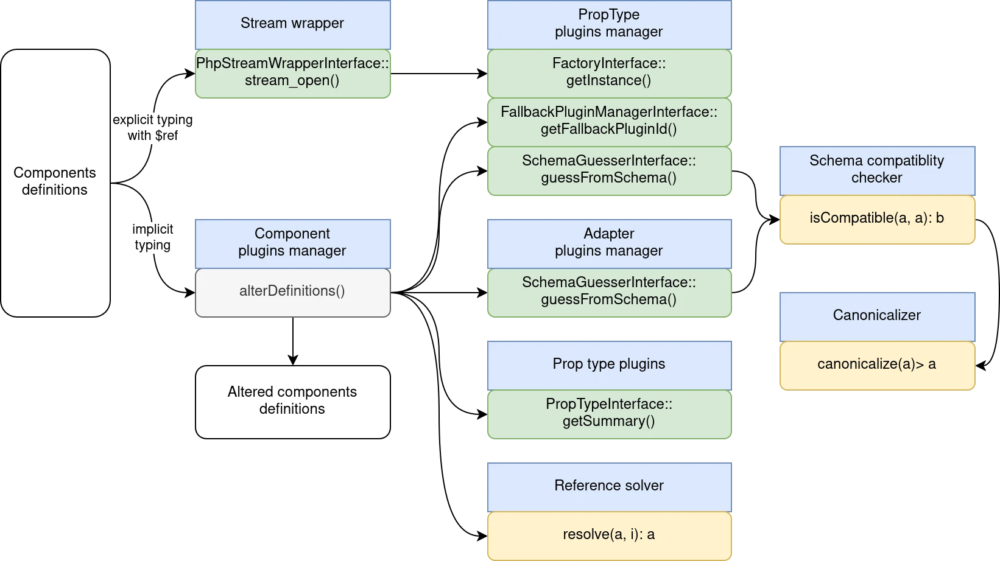
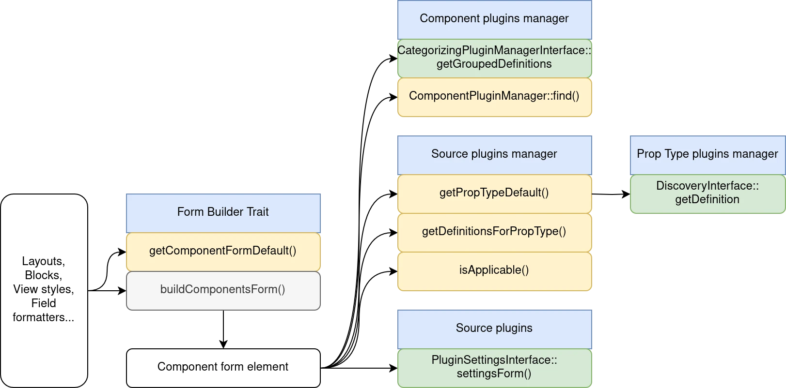
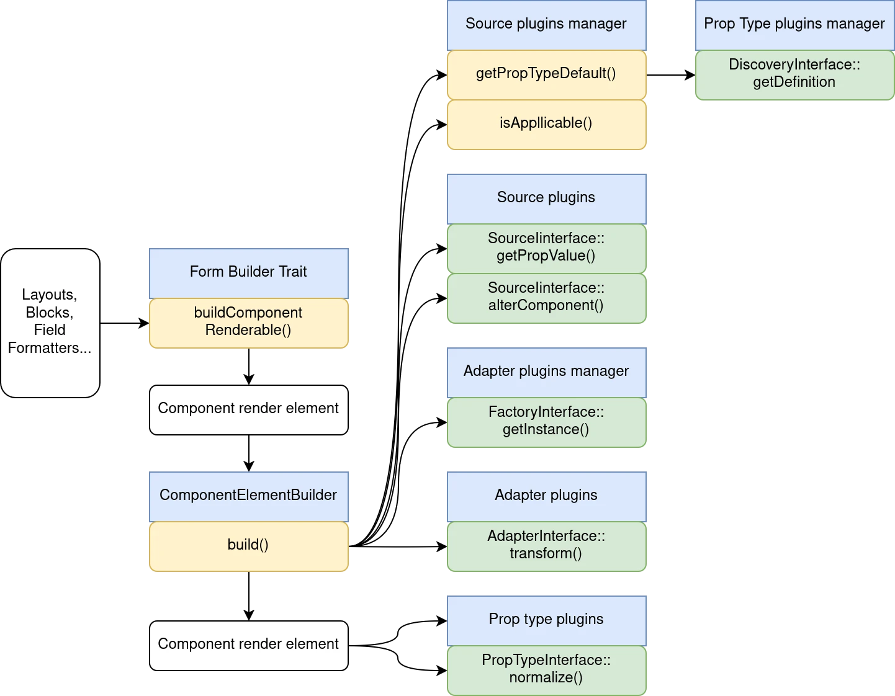

# Internals

> ⚠️ **DRAFT: work in progress**

UI Patterns 2 is doing 3 jobs.

## Guessing the PropType plugin for every components' props.

Schema compatibility checker:

```
src/SchemaManager/
├── Canonicalizer.php
├── CompatibilityChecker.php
├── ReferencesResolver.php
├── ScalarCompatibilityTrait.php
└── StreamWrapper.php
```

For implicit prop type declaration. UI Patterns must work with every SDC component, even the ones not built with UI Patterns. So, if a component is not using a direct reference to a prop type plugin, we can guess the prop type.



## Building a form for each component by loading Source plugins



## Building a renderable from the component form data


